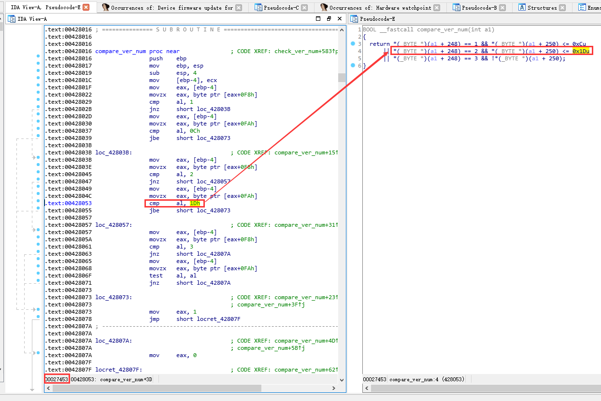
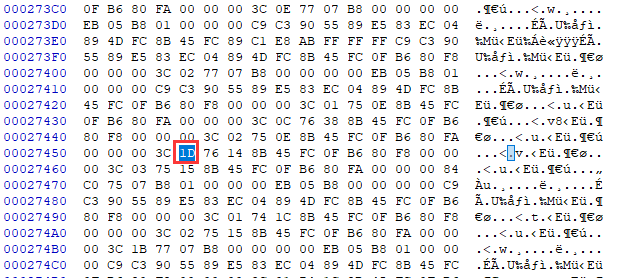

# 暴力升级你的 ST-Link 及 STM32CubeIDE 

## 背景

一些 ST-Link 在使用最新的 IDE 时，经常提示需要升级其固件，但是升级始终失败，提示容量不足。

在 Keil MDK 上可能就提示一下升级失败，但仍然可以继续下载调试。可是当使用 ST 最新推出的 CubeIDE 时（这是一款 ST 新推出的基于 Eclipse 集成 CubeMX 的 IDE），情况就非常糟糕，你如果不升级成功，就没法让你继续使用，仿佛陷入了死循环，导致一些开发板完全无法使用 CubeIDE。

## 问题原因

这些开发板包括 RT-Thread 和 正点原子 联合推出的 [潘多拉 IoT 开发板](https://item.taobao.com/item.htm?spm=a230r.1.14.4.381759c10S57Js&id=583527145598&ns=1&abbucket=9#detail) 。

该开发板上的 ST-Link 用的是 **STM32F103C8T6** ，C8T6 只有 64KB flash，在早期 ST-Link 固件比较小的时候，64KB 完全是够用的。但随着 ST-Link 的功能升级后，固件大小正好超过了 64KB ，导致了现在提示的升级错误，如下图所示。提示信息为：`The up-to-date firmware is too big for this board (4960 bytes in excess). Can't update `。就差这么 4K 多的空间了。

## 解决思路

### 方案1：更换主控

最彻底的解决方法当然是更换 ST-Link 用的 MCU ，比如更换为 pip to pin 兼容的 CBT6（128KB  Flash） ，价格也没有差多少，但需要采购，手工拆卸下来，再焊接上一片新的，焊接完成后还得折腾一番才能烧入 ST-Link 固件，有些麻烦。大家如果有精力可以折腾下，一劳永逸。

### 方案2：修改 CubeIDE 软件

涉及到的 exe 主要有这两个：

- STM32_Programmer_CLI.exe （负责下载）
- ST-LINK_gdbserver.exe （负责调试）

这两个 exe 都有版本检测功能，将其反编译，找到版本号检测功能，简单修改下，应该也可行。

这里使用的工具是 IDA 7.0，在 [吾爱破解](https://www.52pojie.cn/thread-675251-1-1.html) 上可以下载到绿色版本。将其装载后（这里以 ST-LINK_gdbserver.exe 举例），搜索版本号检测提示相关的字符串，追踪相关代码流程，可以追踪到类似如下图代码：

左边是汇编代码，右边是反汇编为 C 的代码，先看右边的代码。很明显这里在进行两个数值对比，当 (a1+248) 地址指向的数值（推测其 ST-Link 固件主版本号）等于 2 时，后再继续对比（a1+250）地址指向的数值（推测其为子版本号），当子版本号 `<=0x1D` 即十进制 29 时，条件成立。

当前出厂的潘多拉 ST-Link 版本号为 `V2J24S11` ，V2J27 再往后版本就无法升级了。条件里的 29 正好大于潘多拉的 J24  ，所以提示版本过低。

回到左边的汇编视图，记下 `cmp a1, 1Dh ` 代码左下角对应的偏移量 `0x00027453` 。使用 hex 工具打开 `ST-LINK_gdbserver.exe` ，找到 `0x00027453`  后面的 `0x1D` 位置，将其修改为你想要的版本号即可。比如这里修改为 `0x14` （十进制20），这样只要版本号大于 `V2J20` 的 ST-Link 都可以使用这个 exe 了。修改后进行了简单测试，发现限制确实被取消了。

 

另外一个 exe 的修改方法类似，这里不再赘述。如果不想动手修改，可以看下面的使用章节，直接在 CubeIDE 里替换掉这两个 exe 即可。

### 方案3：修改 ST-Link 升级器软件（部分用户升级失败，不推荐）

这里要首先讲一个常识，一般的 STM32 芯片片内都会在末尾预留一部分 Flash 空间出来，只是这部分 flash 空间 ST 不保证 Flash 质量。如果能将末尾预留 Flash 利用起来，`C8T6` 也许也能当 `CBT6` 来用。所以问题的重点就聚焦在如何让升级器软件 **取消 Flash 容量检查的限制**。

搜索一番，果真就有。这个方案出自这位老外：https://lujji.github.io/blog/installing-blackmagic-via-stlink-bootloader/ 。思路还是挺新颖的，大家如果有精力可以深入看一下。

虽然是两年前的方法了，但是也适用于笔者用的 STLinkUpgrade V3.3.0 。

### 重要提示

方案 3 的实际测试结果来看，虽然规避了升级器的容量检查，但存在一定几率的升级失败，此时 ST-Link 就会变砖。不过文档末尾也有很简单的救砖教程，升级失败后可以尝试救砖。愿意折腾的还能继续升级，至少我有一个开发板是重复升级了2次，最后也终于成功了。

## 方案 2 如何使用

### STEP1：找到 STM32CubeIDE 安装路径，确定待替换 exe 路径

也可以直接使用 everything 之类的搜索软件，快速地位下面两个 exe 的路径

- STM32_Programmer_CLI.exe  一般位于 `STM32CubeIDE_1.0.0\STM32CubeIDE\plugins\com.st.stm32cube.ide.mcu.externaltools.cubeprogrammer.win32_1.0.0.201904021149\tools\bin`
- ST-LINK_gdbserver.exe 一般位于 `STM32CubeIDE_1.0.0\STM32CubeIDE\plugins\com.st.stm32cube.ide.mcu.externaltools.stlink-gdb-server.win32_1.0.0.201904160814\tools\bin`

> 注意：上面路径的日期标识可能与你的实际路径略微不同

### STEP2：替换 exe 

将项目目录下 `STM32CubeIDE` 对应的 exe 替换过去即可，如果不放心记得提前备份下旧版本 exe 。

此时你的 CubeIDE 即可放心使用类似潘多拉等集成旧版本 ST-Link 的开发板了。

> PS：当前破解的这两个 exe 只能用于固件版本大于 V2J20  的 ST-Link ，暂不支持更低版本

## 方案 3 如何使用（暂不推荐）

### STEP1：安装 Java 运行环境

如果电脑上没有 Java 运行环境，可以看这里：https://jingyan.baidu.com/article/4e5b3e1909043f91911e2464.html

### STEP2 ：双击打开 STLinkUpgrade/STLinkUpgradeHacked.jar

### STEP3: 进入升级模式

### STEP4：开始升级

点击 `Upgrade` 即可。

### STEP5：确认升级成功

升级后复位下，打开 Keil MDK 看一下，如果能够正常的找到 ST-Link 并连接芯片，恭喜你，升级成功了。

如果提示：`ST-Link in DFU mode. Restart it or upgrade it.` 如下图所示

很遗憾，本次升级失败了，不过不要害怕，下面还有救砖教程，保证 ST-Link 还能被还原。

还原后，想继续折腾的也可以重新升级试试，没准这次就成功了。实在不行，那也就只能更换主控了，祝大家好运。

## 救砖指南

### SETP1：打开 recovery 文件夹下的 ST-LinkUpgrade_V2.J27.M15.exe

这是一个旧版本的 ST-Link 升级器，可以将我们的固件还原。

### STEP2：执行升级

点击 `Device Connect` 后，再点击 `Yes` 即可

## 致谢

- 感谢大法师 [@lymzzyh](https://github.com/lymzzyh) 及 小白 [@Zero-Free](https://github.com/Zero-Free) 的支持，在他们的帮助下完成了 ST-Link 固件更换测试工作
- 感谢 [@lujji](https://github.com/lujji) 这位老外的修改教程，大家有兴趣也可以去他的 GItHub 逛逛 https://github.com/lujji
- 感谢 [@enkiller](<https://github.com/enkiller>) 在 exe 破解给予的一定指导，以及正点的小石头兄弟先前做的一些破解工作

-----

## 注意

- 仅在 ST-Link V2.1 上做过测试，其他版本慎用；
- 请勿用于商业用途；

